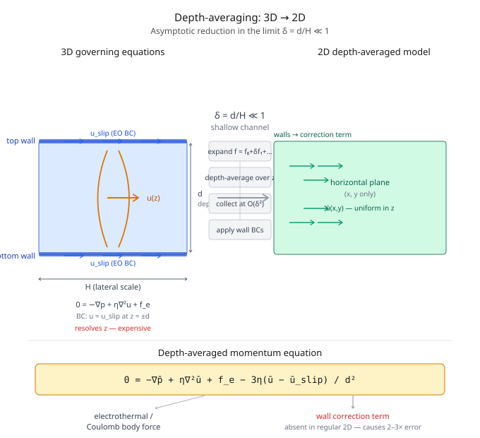

# Multiphysics Simulation in Electrokinetic Microfluidics

**Reduced-order modeling of coupled transport phenomena in shallow PDMS microchannels**

*Yilong Zhou — Clemson University (PhD research)*

---

## Overview

This repository documents four coupled-physics simulation projects from my PhD work on electrokinetic microfluidics. The unifying contribution is a **2D depth-averaged numerical model** derived from a second-order asymptotic analysis of the full 3D governing equations — enabling accurate, computationally efficient simulation of coupled electric, thermal, flow, and species transport in shallow microchannels.

The core question each project addresses: *how does a physical effect change fluid behavior at a reservoir-microchannel junction, and can a reduced-order model capture it accurately enough to be useful?*

---

## The Key Idea: Depth-Averaging



Full 3D simulation of electrokinetic microchannels is computationally expensive. A naive 2D model (infinite depth assumption) is fast but systematically wrong — it ignores the viscous drag and electroosmotic slip from the top and bottom channel walls, causing:

- 2–3× under-prediction of electrokinetic instability threshold electric fields
- Incorrect vortex size, location, and orientation in induced-charge flow
- Unphysical temperature fields requiring unrealistic fitting parameters

The depth-averaged approach treats the channel's shallow aspect ratio as a smallness parameter δ = d/H ≪ 1. Expanding the 3D governing equations asymptotically in δ and depth-averaging yields 2D equations that recover the wall effects through an additional body-force term in the momentum equation:

$$0 = -\nabla_H \bar{p} + \nabla_H \cdot (\eta \nabla_H \bar{\mathbf{u}}) + \mathbf{f}_e \underbrace{- \frac{3\eta(\bar{\mathbf{u}} - \bar{\mathbf{u}}_{slip})}{d^2}}_{\text{wall correction — missing in regular 2D}}$$

Full derivation, including the temperature equation, ICEO electric field in fluid+wall, and the Taylor dispersion correction for species transport: [theory/depth_averaging_derivation.md](theory/depth_averaging_derivation.md)

---

## Projects

| # | Physical effect | Publication | My role |
|---|---|---|---|
| 1 | Joule heating → electrothermal vortices at channel entrance | *Electrophoresis* 2017 | Derived depth-avg model; COMSOL simulation |
| 2 | Conductivity mismatch → electrokinetic instability in ferrofluid | *Microfluid. Nanofluid.* 2015 | Simulation + **all experiments** |
| 3 | Same, with depth-averaged model across four channel depths | *Scientific Reports* 2017 | Simulation + experiments |
| 4 | Induced charge → ICEO vortices at dielectric corners | *Phys. Fluids* 2017 | Derived depth-avg model; COMSOL simulation |

---

### 1. Joule Heating on Electroosmotic Entry Flow

[→ Full model details](models/joule_heating_entry_flow/README.md)

DC-biased AC electric fields drive electroosmotic flow through a PDMS microchannel. Joule heating is concentrated in the narrow constriction at the channel entrance, raising local temperature and creating fluid property gradients. The electric field acts on these gradients to produce an **electrothermal body force**, generating counter-rotating vortices above a threshold AC voltage.

**Coupled physics:** electric field → temperature (with substrate thermal resistance BCs) → viscosity/conductivity/permittivity → electrothermal body force → flow

**Key result:** Vortex size and location match experiment across four AC voltages (450–700 V AC, 20 V DC bias). Computational cost: 10 min on a laptop vs. >4 hours on a 24-core cluster for the equivalent 3D model.


---

### 2. Electric Field-Induced Instabilities in Ferrofluid Microflows

[→ Full model details](models/ferrofluid_instability_2015/README.md)

Ferrofluid and DI water co-flow through a T-shaped microchannel. Their 180× conductivity mismatch induces free charge at the interface; above a threshold DC electric field this produces instability waves and chaotic flow at low Reynolds number.

**My experimental contribution:** fabricated the T-shaped PDMS channels, prepared ferrofluid solutions at three concentrations, measured threshold electric fields, characterized conductivity vs. concentration.

**Key result:** Threshold decreases with ferrofluid concentration. Regular 2D model predicts the trend but under-predicts by 2–3× — motivating the depth-averaged model in Paper 3.


---

### 3. Electrokinetic Instability — Depth-Averaged Model

[→ Full model details](models/ferrofluid_instability_2017/README.md)

Extends Paper 2 with the nonlinear depth-averaged model and tests it across four channel depths (32–100 µm) and three ferrofluid concentrations. Includes a Taylor dispersion correction in the species transport equation derived from the asymptotic analysis.

**Three-way comparison at threshold (0.2× ferrofluid, 45 µm channel):**

| Experiment | Regular 2D | Depth-averaged |
|:---:|:---:|:---:|
|  |  |  |
| 175.0 V/cm threshold | Chaotic already at 60.4 V/cm | Periodic waves at 202.1 V/cm (+15.5%) ✓ |

**Key result:** Depth-averaged model predicts threshold electric fields within 6.6–15.5% for shallow channels (d/W < 0.3). Regular 2D model under-predicts by 49–80% across all tested depths.

---

### 4. Induced Charge Effects on Electrokinetic Entry Flow

[→ Full model details](models/induced_charge_ICEO/README.md)

In low-ionic-concentration electroosmotic flow, Joule heating is negligible. Instead, electric field leaking into the dielectric PDMS corners at the channel entrance polarizes the corner surfaces — generating induced charge that drives counter-rotating vortices (ICEO). Particles get trapped and concentrated at the corners via ICEO + positive DEP.

**Coupled physics:** electric field in fluid AND PDMS wall simultaneously (Laplace's equation in both, Robin-type BC at interface) → induced zeta potential → ICEO slip → vortex flow → particle trapping

**Key result:** Depth-averaged model correctly predicts vortex size and location. Regular 2D model fails on both — off by the order of magnitude reported in prior literature — because it ignores top/bottom wall damping on ICEO.


---

## Repository Structure

```
multiphysics-simulation/
├── README.md                          ← you are here
├── theory/
│   └── depth_averaging_derivation.md  ← full asymptotic derivation (all 5 equations)
├── models/
│   ├── joule_heating_entry_flow/
│   │   └── README.md                  ← coupled E/T/flow, thermal resistance BCs
│   ├── ferrofluid_instability_2015/
│   │   └── README.md                  ← 2D model + experimental measurements
│   ├── ferrofluid_instability_2017/
│   │   └── README.md                  ← depth-averaged model, 3-way comparison
│   └── induced_charge_ICEO/
│       └── README.md                  ← dual-domain E field, ICEO, DEP particle tracing
└── assets/
    ├── README.md                      ← directory guide + ffmpeg GIF conversion commands
    ├── figures/                       ← static PNG/SVG exports
    └── videos/                        ← GIFs from experimental and simulation recordings
```

---

## Technical Stack

| Tool | Role |
|---|---|
| COMSOL Multiphysics 5.1/5.2 | Primary simulation platform |
| COMSOL modules used | Electric Currents, Electrostatics, Heat Transfer in Fluids/Solids, Laminar Flow, Transport of Diluted Species |
| Custom depth-avg terms | Added via COMSOL "Force" and "Reaction" features |
| Mesh | Structured 4 µm square elements; triangular at fillets |
| Experiment | Nikon Eclipse TE2000U inverted microscope, Nikon DS-Qi1Mc CCD, NIS-Elements AR 2.30 |
| Microfabrication | Standard soft lithography, PDMS, SU-8 photoresist |

---

## Publications

1. Prabhakaran R.A., **Zhou Y.**, Patel S., Kale A., Song Y., Hu G., Xuan X. "Joule heating effects on electroosmotic entry flow." *Electrophoresis* 38, 572–579 (2017). DOI: [10.1002/elps.201600296](https://doi.org/10.1002/elps.201600296)

2. Thanjavur Kumar D., **Zhou Y.**, Brown V., Lu X., Kale A., Yu L., Xuan X. "Electric field-induced instabilities in ferrofluid microflows." *Microfluidics and Nanofluidics* 19, 43–52 (2015). DOI: [10.1007/s10404-015-1546-8](https://doi.org/10.1007/s10404-015-1546-8)

3. Song L., Yu L., **Zhou Y.**, Antao A.R., Prabhakaran R.A., Xuan X. "Electrokinetic instability in microchannel ferrofluid/water co-flows." *Scientific Reports* 7, 46510 (2017). DOI: [10.1038/srep46510](https://doi.org/10.1038/srep46510)

4. Prabhakaran R.A., **Zhou Y.**, Zhao C., Hu G., Song Y., Wang J., Yang C., Xuan X. "Induced charge effects on electrokinetic entry flow." *Physics of Fluids* 29, 062001 (2017). DOI: [10.1063/1.4984741](https://doi.org/10.1063/1.4984741)

---

## Related

Cross-scale simulation spanning quantum → atomistic → continuum: [yilong-sim/cross-scale-simulation](https://github.com/yilong-sim/cross-scale-simulation)

Portfolio: [yilong-sim.github.io](https://yilong-sim.github.io)
