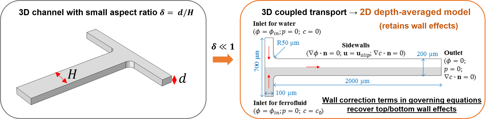
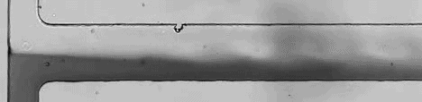
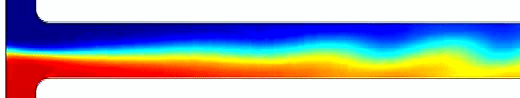
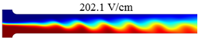
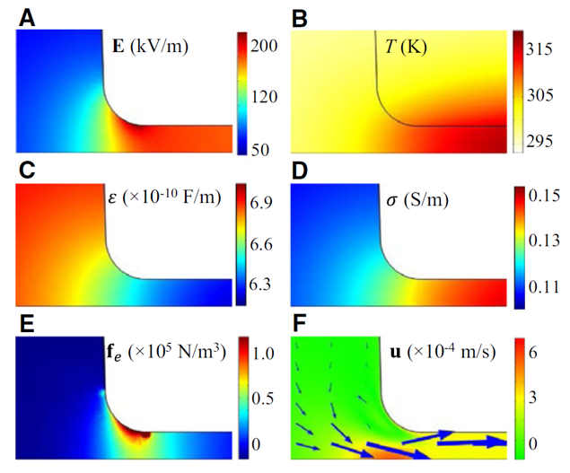
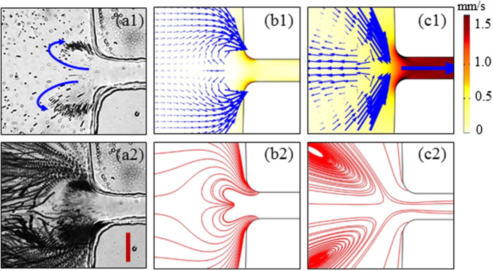

# Multiphysics Simulation in Electrokinetic Microfluidics

**Reduced-order modeling of coupled transport phenomena in shallow PDMS microchannels**

*Yilong Zhou at Clemson University*

---

## Overview

This repository documents four coupled-physics simulation projects from my work on electrokinetic microfluidics. The unifying contribution is a **2D depth-averaged numerical model** derived from a second-order asymptotic analysis of the full 3D governing equations — enabling accurate, computationally efficient simulation of coupled electric, thermal, flow, and species transport in shallow microchannels.

The core question each project addresses: *how does a physical effect change fluid behavior at a reservoir-microchannel junction, and can a reduced-order model capture it accurately enough to be useful?*

---

## The Key Idea: Depth-Averaging



Full 3D simulation of electrokinetic microchannels is computationally expensive. A naive 2D model (infinite depth assumption) is fast but systematically wrong — it ignores the viscous drag and electroosmotic slip from the top and bottom channel walls, causing:

- 2–3× under-prediction of electrokinetic instability threshold electric fields
- Incorrect vortex size, location, and orientation in induced-charge flow
- Unphysical temperature fields requiring unrealistic fitting parameters

The depth-averaged approach treats the channel's shallow aspect ratio as a smallness parameter δ = d/H ≪ 1. Expanding the 3D governing equations asymptotically in δ and depth-averaging yields 2D equations that recover the wall effects through an additional correction term in the momentum equation:

$$0 = -\nabla_H \bar{p} + \nabla_H \cdot (\eta \nabla_H \bar{\mathbf{u}}) + \mathbf{f}_e - \underbrace{\frac{3\eta(\bar{\mathbf{u}} - \bar{\mathbf{u}}_{slip})}{d^2}}_{\text{wall correction — absent in regular 2D}}$$

Full derivation including the temperature equation, ICEO dual-domain electric field, and Taylor dispersion correction for species transport: [theory/depth_averaging_derivation.md](theory/depth_averaging_derivation.md)

---

## Projects

| # | Physical effect | Publication | My role |
|---|---|---|---|
| 1 | Conductivity mismatch → electrokinetic instability in ferrofluid | *Microfluid. Nanofluid.* 2015 + *Sci. Rep.* 2017 | Simulation (joint) + **all experiments** |
| 2 | Joule heating → electrothermal vortices at channel entrance | *Electrophoresis* 2017 | Derived depth-avg model; COMSOL simulation (joint) |
| 3 | Induced charge → ICEO vortices at dielectric corners | *Phys. Fluids* 2017 | Derived depth-avg model; COMSOL simulation (joint) |

---

### 1. Electrokinetic Instability in Ferrofluid/Water Co-flows

[→ 2015 model details](models/ferrofluid_instability_2015/README.md) · [→ 2017 depth-averaged model](models/ferrofluid_instability_2017/README.md)

Ferrofluid and DI water co-flow through a T-shaped microchannel. Their ~180× electrical conductivity mismatch induces free charge at the interface; above a threshold DC electric field this produces instability waves and chaotic flow at Reynolds number ≈ 1.

**My experimental contribution (2015):** fabricated T-shaped PDMS microchannels by soft lithography, prepared ferrofluid solutions at three concentrations (0.1×, 0.2×, 0.3×), measured threshold electric fields, characterized conductivity vs. concentration.

**2015 → 2017 progression:** The initial regular 2D model correctly predicted the decreasing instability threshold with increasing ferrofluid concentration, but under-predicted threshold electric fields by 2–3× for all conditions. This systematic error was traced to the complete neglect of top/bottom wall stabilizing effects. The *Scientific Reports* follow-on developed the nonlinear depth-averaged model — extending the asymptotic analysis to include a Taylor dispersion correction in the species transport equation — and validated it across four channel depths (32–100 µm).

**Three-way comparison at threshold (0.2× ferrofluid, 45 µm channel):**

| Experiment | Regular 2D model | Depth-averaged model |
|:---:|:---:|:---:|
|  |  |  |
| 175.0 V/cm — periodic waves, **inclined upstream ←** | Chaotic at 60.4 V/cm; waves **inclined downstream →** ✗ | Periodic waves at 202.1 V/cm; **inclined upstream ←** ✓ |

The depth-averaged model captures two independent failure modes of the regular 2D model: the wrong threshold electric field (60.4 vs 175.0 V/cm) **and** the wrong wave inclination direction. The regular 2D model predicts waves tilted downstream because it over-predicts electroosmotic velocity in the ferrofluid — a direct consequence of ignoring top/bottom wall drag. The depth-averaged model corrects both simultaneously.

> The regular 2D simulation is run at a lower electric field than the experiment because the model triggers instability far too early. Labels show the actual field used in each simulation.

**Quantitative summary (0.2× ferrofluid):**

| Channel depth | Experiment | Depth-averaged | Error | Regular 2D | Error |
|---|---|---|---|---|---|
| 32 µm | 305.6 V/cm | 326.0 V/cm | +6.6% | 60.4 V/cm | −80% |
| 45 µm | 175.0 V/cm | 202.1 V/cm | +15.5% | 60.4 V/cm | −65% |
| 60 µm | 119.4 V/cm | 151.1 V/cm | +27% | 60.4 V/cm | −49% |
| 100 µm | 83.3 V/cm | 123.4 V/cm | +48% | 60.4 V/cm | −27% |

Depth-averaged model accuracy: d/W < 0.3 → 6–15% error; d/W > 0.5 → regular 2D becomes adequate as wall effects weaken.

---

### 2. Joule Heating Effects on Electroosmotic Entry Flow

[→ Full model details](models/joule_heating_entry_flow/README.md)

DC-biased AC electric fields drive electroosmotic flow through a PDMS microchannel. Joule heating concentrates in the narrow constriction at the channel entrance, raising local temperature and creating fluid property gradients. The electric field acts on these gradients via the **electrothermal body force**, generating counter-rotating vortices above a threshold AC voltage.

**Coupled physics:** electric field → temperature (substrate thermal resistance BCs) → conductivity / permittivity / viscosity → electrothermal body force → flow



Electric field (A), temperature (B), permittivity (C), conductivity (D), electrothermal body force (E), and velocity magnitude (F) at 20 V DC-biased 600 V AC. The constriction amplifies E by ~4×, raising local temperature ~20 K, shifting σ by +50% and ε by −10%, producing the body force that drives the circulations in F.

**Key result:** Vortex size and location match experiment across four AC voltages (450–700 V AC). The depth-averaged thermal model replaces the unrealistic convective coefficient assumption of prior 2D models with proper substrate thermal resistance terms — no fitting parameters. Computational cost: **10 min on a laptop** vs. **>4 hours on a 24-core cluster** for the equivalent 3D model.

---

### 3. Induced Charge Effects on Electrokinetic Entry Flow

[→ Full model details](models/induced_charge_ICEO/README.md)

In low-ionic-concentration flow, Joule heating is negligible. Instead, electric field leaks into the dielectric PDMS corners at the channel entrance, polarizing the corner surfaces and generating **induced charge electroosmosis (ICEO)** — counter-rotating vortices that trap and concentrate particles via ICEO + positive DEP.

**Coupled physics:** Laplace's equation solved simultaneously in fluid AND PDMS wall → Robin-type BC yields induced zeta potential → ICEO slip velocity → vortex flow → particle tracing (EO + EP + DEP)



The depth-averaged model (center) correctly predicts vortex location near the channel entrance corners. The regular 2D model (right) predicts the wrong location, wrong size, and wrong orientation — the largest discrepancy class in the ICEO literature — because it ignores top/bottom wall damping entirely.

**Key result:** Maximum induced zeta potential scales linearly with AC voltage and wall permittivity, and exponentially with decreasing corner radius. Reducing corner radius from 40 µm to 2 µm increases peak vorticity by >24× (60 s⁻¹ → 1450 s⁻¹).

---

## Repository Structure

```
multiphysics-simulation/
├── README.md
├── theory/
│   └── depth_averaging_derivation.md     ← full asymptotic derivation (5 equations)
├── models/
│   ├── ferrofluid_instability_2015/
│   │   └── README.md                     ← regular 2D model + all experimental work
│   ├── ferrofluid_instability_2017/
│   │   └── README.md                     ← depth-averaged model, 3-way comparison
│   ├── joule_heating_entry_flow/
│   │   └── README.md                     ← coupled E/T/flow, thermal resistance BCs
│   └── induced_charge_ICEO/
│       └── README.md                     ← dual-domain E field, ICEO, DEP tracing
└── assets/
    ├── README.md                       
    ├── figures/
    └── videos/
```

---

## Technical Stack

| Tool | Role |
|---|---|
| COMSOL Multiphysics 5.1/5.2 | Primary simulation platform |
| Modules | Electric Currents, Electrostatics, Heat Transfer in Fluids/Solids, Laminar Flow, Transport of Diluted Species |
| Depth-avg wall terms | Added via COMSOL "Force" and "Reaction" features |
| Mesh | Structured 4 µm square elements; triangular at T-junction fillets |
| Imaging | Nikon Eclipse TE2000U, Nikon DS-Qi1Mc CCD, NIS-Elements AR 2.30 |
| Microfabrication | Soft lithography, PDMS, SU-8 photoresist |

---

## Publications

1. Thanjavur Kumar D., **Zhou Y.**, Brown V., Lu X., Kale A., Yu L., Xuan X. "Electric field-induced instabilities in ferrofluid microflows." *Microfluidics and Nanofluidics* 19, 43–52 (2015). DOI: [10.1007/s10404-015-1546-8](https://doi.org/10.1007/s10404-015-1546-8)

2. Song L., Yu L., **Zhou Y.**, Antao A.R., Prabhakaran R.A., Xuan X. "Electrokinetic instability in microchannel ferrofluid/water co-flows." *Scientific Reports* 7, 46510 (2017). DOI: [10.1038/srep46510](https://doi.org/10.1038/srep46510)

3. Prabhakaran R.A., **Zhou Y.**, Patel S., Kale A., Song Y., Hu G., Xuan X. "Joule heating effects on electroosmotic entry flow." *Electrophoresis* 38, 572–579 (2017). DOI: [10.1002/elps.201600296](https://doi.org/10.1002/elps.201600296)

4. Prabhakaran R.A., **Zhou Y.**, Zhao C., Hu G., Song Y., Wang J., Yang C., Xuan X. "Induced charge effects on electrokinetic entry flow." *Physics of Fluids* 29, 062001 (2017). DOI: [10.1063/1.4984741](https://doi.org/10.1063/1.4984741)

---

## Related

Portfolio: [yilong-sim.github.io](https://yilong-sim.github.io)
