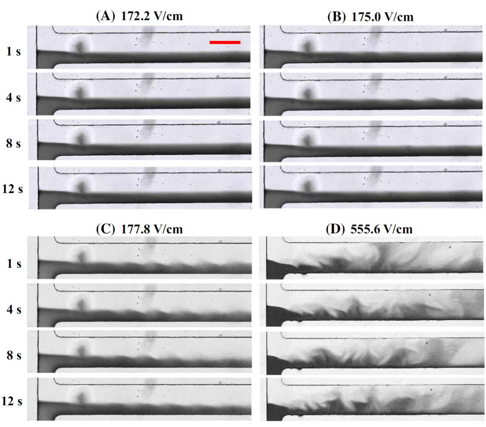

# Electric Field-Induced Instabilities in Ferrofluid Microflows

**Publication:** Thanjavur Kumar D., Zhou Y. et al., *Microfluidics and Nanofluidics* 19, 43–52 (2015)  
DOI: [10.1007/s10404-015-1546-8](https://doi.org/10.1007/s10404-015-1546-8)

> **Part 1 of 2** — This paper establishes the phenomenon and provides the experimental baseline. The regular 2D model correctly captures trends but fails in two independent ways: it under-predicts threshold electric fields by 2–3×, and predicts instability waves inclined in the wrong direction. Both are fixed by the depth-averaged model in [Part 2](../ferrofluid_instability_2017/README.md).

---

## Problem

This work demonstrates for the first time that a DC electric field can drive electroosmotic flow of ferrofluid while simultaneously producing strong **electrokinetic instabilities** at the ferrofluid/water interface. The mechanism is the electrical conductivity mismatch between the two fluids: ferrofluid is approximately 180× more conductive than DI water, inducing free charge at the interface that the electric field acts upon to generate a destabilizing body force.

At sufficient electric field strength, the interface transitions from stable diffusion → periodic instability waves → chaotic flow, all at Reynolds number ≈ 1.

---

## Instability Progression (Experimental)

Time-series snapshots of 0.2× ferrofluid (dark)/water co-flow at four DC electric fields. Stable diffusion at 172.2 V/cm; intermittent waves at 175.0 V/cm; sustained periodic waves at 177.8 V/cm (threshold); chaotic flow at 555.6 V/cm. All my experimental work — microchannel fabrication, solution preparation, imaging, and threshold measurement.

---

## My Experimental Contribution

**Microchannel fabrication:** T-shaped PDMS channel by standard soft lithography. Side branches 8 mm × 100 µm; main branch 10 mm × 200 µm; depth 40 µm throughout.

**Ferrofluid preparation:** EMG 408 (Ferrotec, Fe₃O₄ nanoparticles, ~10 nm diameter) at three concentrations: 0.1×, 0.2×, 0.3× by volume fraction. Measured electrical conductivity by Accumet AP85 conductivity meter — linear with concentration, R² = 0.9975.

**Threshold measurement:** Electric field increased continuously from zero; threshold defined as the minimum field at which periodic waves are visually sustained at the T-junction.

---

## Governing Equations

**Electric field:**
$$\nabla \cdot (\sigma \nabla \phi) = 0$$

**Navier-Stokes with electric body force (Coulomb + dielectric):**
$$\rho\left(\frac{\partial \mathbf{u}}{\partial t} + \mathbf{u} \cdot \nabla \mathbf{u}\right) = -\nabla p + \mu \nabla^2 \mathbf{u} + \rho_e \mathbf{E} - \frac{1}{2}E^2 \nabla \varepsilon$$

**Species transport (ferrofluid concentration):**
$$\frac{\partial c}{\partial t} + \mathbf{u} \cdot \nabla c = D\nabla^2 c$$

Fluid properties concentration-dependent:
$$\sigma = c\sigma_f + (1-c)\sigma_w, \qquad \mu = \mu_f \, e^{\ln(\mu_w/\mu_f)(1-c)}$$

---

## Parameters

| Symbol | Value | Description |
|---|---|---|
| σ_w | 2.95 × 10⁻³ S/m | Water electric conductivity |
| σ_f | 5.324 × 10⁻¹ S/m | 1× ferrofluid conductivity |
| µ_w | 1 × 10⁻³ Pa·s | Water viscosity |
| µ_f | 2 × 10⁻³ Pa·s | 1× ferrofluid viscosity |
| ζ | −0.1 V | Wall zeta potential |
| D | 1 × 10⁻⁹ m²/s | Ferrofluid diffusivity (model) |

---

## Key Results

| Ferrofluid concentration | Experimental threshold |
|---|---|
| 0.1× | 213.8 V/cm |
| 0.2× | 177.8 V/cm |
| 0.3× | 169.4 V/cm |

Threshold decreases with increasing ferrofluid concentration — higher σ_f increases the conductivity ratio and hence the destabilizing free charge density at the interface. The regular 2D model predicts this decreasing trend correctly.

---

## Why the Model Falls Short — and What Comes Next

The regular 2D model fails in two independent ways, both traceable to the same root cause: ignoring top/bottom wall effects.

**1. Wrong threshold electric field.** The model under-predicts threshold electric fields by 2–3× for all tested conditions. The top and bottom walls damp instability by adding viscous drag; without this resistance, the model goes unstable too easily.

**2. Wrong wave inclination direction.** Experimental instability waves are inclined upstream (←). The regular 2D model predicts waves inclined downstream (→). This happens because the model over-predicts electroosmotic velocity in the ferrofluid — a direct consequence of ignoring top/bottom wall drag — which causes the waves to be convected too strongly in the flow direction.

The fix — a nonlinear depth-averaged model that recovers both wall drag and electroosmotic slip from the top/bottom surfaces through a correction term derived by asymptotic analysis — is developed and validated in [Part 2](../ferrofluid_instability_2017/README.md).
