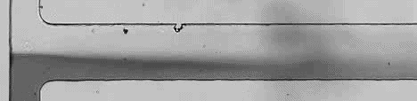
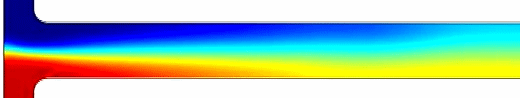
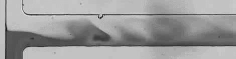
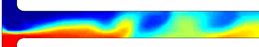

# Electrokinetic Instability in Microchannel Ferrofluid/Water Co-flows

**Publication:** Song L., Yu L., Zhou Y. et al., *Scientific Reports* 7, 46510 (2017)  
DOI: [10.1038/srep46510](https://doi.org/10.1038/srep46510)

---

## Problem

The 2015 ferrofluid instability paper established that the regular 2D model under-predicts threshold electric fields by 2–3× for all tested concentrations. This work fixes that by developing a **nonlinear depth-averaged model** that accounts for the stabilizing influence of the top and bottom channel walls — the physics the regular 2D model omits entirely.

The wall correction term −3μ**U**/d² in the depth-averaged momentum equation raises the effective viscous damping, requiring a stronger electric field to trigger instability. Without it, the model predicts instability too easily.

---

## Three-Way Comparison

The core result is the comparison across three models at matched experimental conditions. The table below maps assets to each voltage case.

> **Asset note:** Experiment and regular 2D columns are animated GIFs converted from video recordings. Depth-averaged column shows static figures from COMSOL output. This difference is intentional — the animated columns show *why* the regular 2D model fails dynamically, and the static figure shows that the depth-averaged result matches the experimental steady pattern.

### 138.9 V/cm — stable co-flow (below threshold)

| Experiment | Regular 2D model | Depth-averaged model |
|:---:|:---:|:---:|
|  |  |  |
| Pure diffusion, no waves | Pure diffusion (at much lower field) | Pure diffusion ✓ |

### 175.0 V/cm — threshold instability

| Experiment | Regular 2D model | Depth-averaged model |
|:---:|:---:|:---:|
|  |  |  |
| Periodic waves, inclined upstream | Already chaotic at only 60.4 V/cm — wrong threshold | Periodic waves at 202.1 V/cm — 15.5% over ✓ |

### 277.8 V/cm — chaotic flow

| Experiment | Regular 2D model | Depth-averaged model |
|:---:|:---:|:---:|
|  |  |  |
| Chaotic, broad-spectrum waves | Chaotic at much lower field | Chaotic predicted ✓ |

Note: the regular 2D simulations are run at a lower electric field than the experiments because the model goes chaotic far too early. The labels show the actual field used in each simulation.

---

## Depth Comparison (0.2× ferrofluid)

Instability waves extend their wavelength in deeper channels, consistent with reduced top/bottom wall damping requiring weaker electroosmotic flow to convect the waves downstream.

---

## Quantitative Results

**Threshold electric field vs channel depth (0.2× ferrofluid):**

| Depth | Experiment | Depth-avg model | Error | Regular 2D | Error |
|---|---|---|---|---|---|
| 32 µm | 305.6 V/cm | 326.0 V/cm | +6.6% | 60.4 V/cm | −80% |
| 45 µm | 175.0 V/cm | 202.1 V/cm | +15.5% | 60.4 V/cm | −65% |
| 60 µm | 119.4 V/cm | 151.1 V/cm | +27% | 60.4 V/cm | −49% |
| 100 µm | 83.3 V/cm | 123.4 V/cm | +48% | 60.4 V/cm | −27% |

The depth-averaged model over-predicts in deeper channels because the δ = d/H ≪ 1 assumption weakens at d/W = 0.5. The regular 2D model's threshold remains fixed at 60.4 V/cm for all depths — it is insensitive to depth by construction.

**Threshold electric field vs ferrofluid concentration (45 µm channel):**

Depth-averaged model closely tracks the experimental decrease in threshold with increasing ferrofluid concentration. Regular 2D predictions are all substantially below experiment.

---

## Governing Equations

**Electric field:**
$$\nabla \cdot (\sigma \mathbf{E}) = 0$$

**Momentum (depth-averaged with wall correction):**
$$\rho\left(\frac{\partial \mathbf{u}}{\partial t} + \mathbf{u} \cdot \nabla \mathbf{u}\right) = -\nabla p + \nabla \cdot (\mu \nabla \mathbf{u}) + \rho_e \mathbf{E} - \frac{3\mu}{d^2}\mathbf{U}$$

$$\mathbf{U} = \mathbf{u} + \frac{\varepsilon(\zeta' + \zeta'')}{2\mu}\mathbf{E}$$

**Species transport (with Taylor dispersion correction):**
$$\frac{\partial c}{\partial t} + \mathbf{u} \cdot \nabla c = D\nabla^2 c + \frac{2d^2}{105D}\nabla \cdot \left[\mathbf{U}(\mathbf{U} \cdot \nabla c) + (\nabla \cdot \mathbf{U})(\mathbf{U} \cdot \nabla c)\right]$$

The Taylor dispersion correction in the concentration equation is derived in the theory document. It captures how the non-uniform depth velocity profile stretches concentration gradients, enhancing apparent diffusivity in the horizontal plane. Without it, instability onset is incorrectly predicted even when the flow field is accurately represented.

---

## Parameters

| Symbol | Value | Description |
|---|---|---|
| σ_w | 10 × 10⁻⁴ S/m | Water electric conductivity |
| σ_f | 5314.5 × 10⁻⁴ S/m | 1× ferrofluid conductivity |
| µ_w | 1 × 10⁻³ Pa·s | Water viscosity |
| µ_f | 2 × 10⁻³ Pa·s | 1× ferrofluid viscosity |
| ε | 7.083 × 10⁻¹⁰ C²/J·m | Fluid permittivity |
| ζ_PDMS | −0.08 V | PDMS wall zeta potential (top + sides) |
| ζ_glass | −0.06 V | Glass wall zeta potential (bottom) |
| D | 1 × 10⁻⁹ m²/s | Ferrofluid diffusivity (model) |

**Fluid property mixing rules:**

$$\sigma = c\sigma_f + (1-c)\sigma_w$$
$$\mu = \mu_f \, e^{\ln(\mu_w/\mu_f)(1-c)}$$

---

## COMSOL Implementation

Additional depth-averaged terms were added via:
- **Momentum correction** (−3μ**U**/d²): COMSOL "Force" feature in the Laminar Flow module
- **Concentration correction** (Taylor dispersion term): COMSOL "Reaction" feature in the Transport of Diluted Species module

Mesh: structured 4 µm square elements throughout branches; triangular elements at T-junction fillets.

---

## Validity Range

- **d/W < 0.3** → depth-averaged model accurate (6–15% error)
- **d/W 0.3–0.5** → transitional; depth-averaged still preferred
- **d/W > 0.5** → regular 2D becomes comparable (wall effects weaken); 27% error at 100 µm
