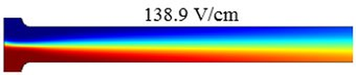
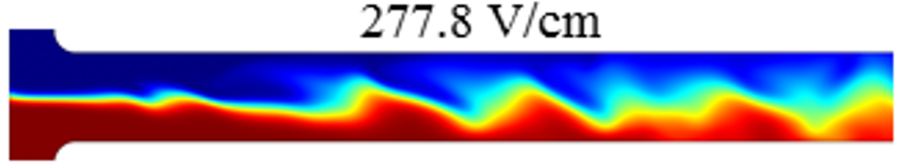

# Electrokinetic Instability in Microchannel Ferrofluid/Water Co-flows

**Publication:** Song L., Yu L., Zhou Y. et al., *Scientific Reports* 7, 46510 (2017)  
DOI: [10.1038/srep46510](https://doi.org/10.1038/srep46510)

> **Part 2 of 2** — Builds on [Part 1](../ferrofluid_instability_2015/README.md), which established the phenomenon and identified two independent failures of the regular 2D model: wrong threshold electric field and wrong wave inclination direction. This paper develops the nonlinear depth-averaged model that fixes both simultaneously.

---

## Problem

The regular 2D model in Part 1 failed in two ways because it ignored the stabilizing influence of the top and bottom channel walls:

1. **Wrong threshold** — under-predicted by 2–3× because wall drag was absent, making the model go unstable too easily
2. **Wrong wave direction** — predicted waves inclined downstream (→) rather than upstream (←) because over-predicted electroosmotic velocity convected the waves too strongly in the flow direction

The wall correction term $-3\mu\mathbf{U}/d^2$ in the depth-averaged momentum equation addresses both: it increases effective viscous damping (fixing the threshold) and reduces net flow velocity (fixing the wave inclination).

---

## Three-Way Comparison

### 138.9 V/cm — stable co-flow (below threshold)

| Experiment | Regular 2D model | Depth-averaged model |
|:---:|:---:|:---:|
|  |  |  |
| Pure diffusion, no waves | Pure diffusion (at lower field) | Pure diffusion ✓ |

### 175.0 V/cm — threshold instability

| Experiment | Regular 2D model | Depth-averaged model |
|:---:|:---:|:---:|
|  |  |  |
| 175.0 V/cm — periodic waves, **inclined upstream ←** | Chaotic at 60.4 V/cm; waves **inclined downstream →** ✗ | Periodic waves at 202.1 V/cm; **inclined upstream ←** ✓ |

The depth-averaged model captures two independent failure modes of the regular 2D model simultaneously: the wrong threshold electric field (60.4 vs 175.0 V/cm) **and** the wrong wave inclination direction. The regular 2D model predicts waves tilted downstream because it over-predicts electroosmotic velocity in the ferrofluid — a direct consequence of ignoring top/bottom wall drag. The depth-averaged model corrects both with a single physically derived correction term.

### 277.8 V/cm — chaotic flow

| Experiment | Regular 2D model | Depth-averaged model |
|:---:|:---:|:---:|
|  |  |  |
| Chaotic, broad-spectrum waves | Chaotic at much lower field ✗ | Chaotic predicted ✓ |

> The regular 2D simulations are run at lower electric fields than the experiments because the model triggers instability far too early. Labels show the actual field used in each simulation.

---

## Governing Equations

**Electric field:**
$$\nabla \cdot (\sigma \mathbf{E}) = 0$$

**Momentum (depth-averaged with wall correction):**
$$\rho\left(\frac{\partial \mathbf{u}}{\partial t} + \mathbf{u} \cdot \nabla \mathbf{u}\right) = -\nabla p + \nabla \cdot (\mu \nabla \mathbf{u}) + \rho_e \mathbf{E} - \frac{3\mu}{d^2}\mathbf{U}$$

$$\mathbf{U} = \mathbf{u} + \frac{\varepsilon(\zeta' + \zeta'')}{2\mu}\mathbf{E}$$

**Species transport (with Taylor dispersion correction):**
$$\frac{\partial c}{\partial t} + \mathbf{u} \cdot \nabla c = D\nabla^2 c + \frac{2d^2}{105D}\nabla \cdot \left[\mathbf{U}(\mathbf{U} \cdot \nabla c) + (\nabla \cdot \mathbf{U})(\mathbf{U} \cdot \nabla c)\right]$$

The Taylor dispersion term captures how the non-uniform depth velocity profile stretches concentration gradients horizontally. Without it, instability onset is incorrectly predicted even when the flow field is accurately represented. Full derivation: [theory/depth_averaging_derivation.md](../../theory/depth_averaging_derivation.md).

---

## Parameters

| Symbol | Value | Description |
|---|---|---|
| σ_w | 10 × 10⁻⁴ S/m | Water electric conductivity |
| σ_f | 5314.5 × 10⁻⁴ S/m | 1× ferrofluid conductivity |
| µ_w | 1 × 10⁻³ Pa·s | Water viscosity |
| µ_f | 2 × 10⁻³ Pa·s | 1× ferrofluid viscosity |
| ε | 7.083 × 10⁻¹⁰ C²/J·m | Fluid permittivity |
| ζ' | −0.08 V | PDMS wall zeta potential (top + sides) |
| ζ'' | −0.06 V | Glass wall zeta potential (bottom) |
| D | 1 × 10⁻⁹ m²/s | Ferrofluid diffusivity (model) |

Fluid property mixing rules:
$$\sigma = c\sigma_f + (1-c)\sigma_w, \qquad \mu = \mu_f \, e^{\ln(\mu_w/\mu_f)(1-c)}$$

---

## Quantitative Results

**Threshold electric field vs channel depth (0.2× ferrofluid):**

| Depth | Experiment | Depth-averaged | Error | Regular 2D | Error |
|---|---|---|---|---|---|
| 32 µm | 305.6 V/cm | 326.0 V/cm | +6.6% | 60.4 V/cm | −80% |
| 45 µm | 175.0 V/cm | 202.1 V/cm | +15.5% | 60.4 V/cm | −65% |
| 60 µm | 119.4 V/cm | 151.1 V/cm | +27% | 60.4 V/cm | −49% |
| 100 µm | 83.3 V/cm | 123.4 V/cm | +48% | 60.4 V/cm | −27% |

The depth-averaged model over-predicts in deeper channels because the δ = d/H ≪ 1 assumption weakens at d/W = 0.5. The regular 2D threshold is fixed at 60.4 V/cm for all depths — insensitive to channel depth by construction.

**Validity range:**

| d/W ratio | Recommended model |
|---|---|
| < 0.3 | Depth-averaged (6–15% error) |
| 0.3–0.5 | Transitional; depth-averaged preferred |
| > 0.5 | Regular 2D adequate (wall effects weaken) |

---

## COMSOL Implementation

Additional depth-averaged terms were added via:
- **Momentum wall correction** ($-3\mu\mathbf{U}/d^2$): COMSOL "Force" feature in the Laminar Flow module
- **Taylor dispersion correction**: COMSOL "Reaction" feature in the Transport of Diluted Species module

Mesh: structured 4 µm square elements throughout branches; triangular elements at T-junction fillets.
